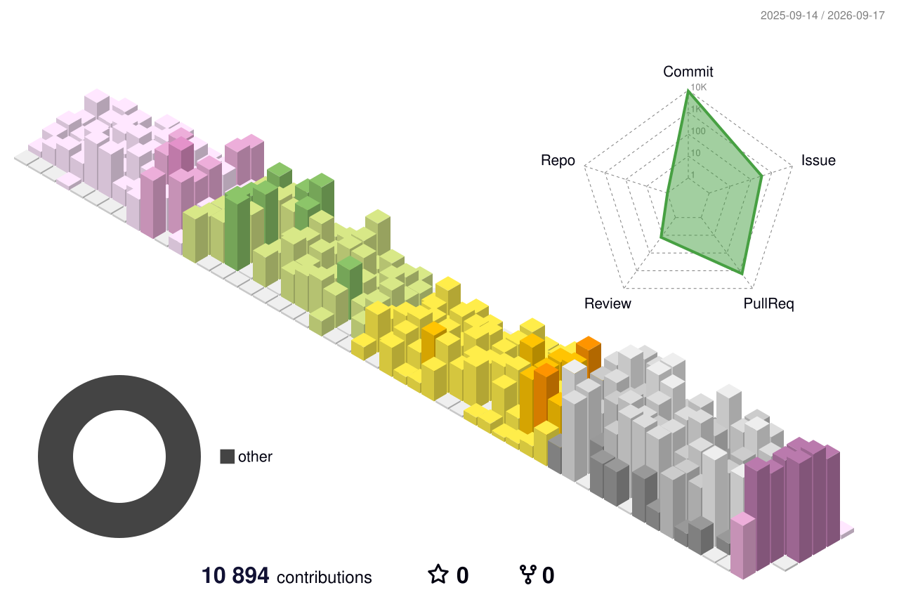

Full-stack dev at [superdev-tech](https://github.com/superdev-tech) — I build the Nuxt/Vue frontends and the Go/PHP backends behind them, mostly on things you can't see, because they're private 😄

Fond of marketing sites with heavy scroll animation, and of making fintech flows boring enough to be reliable.

